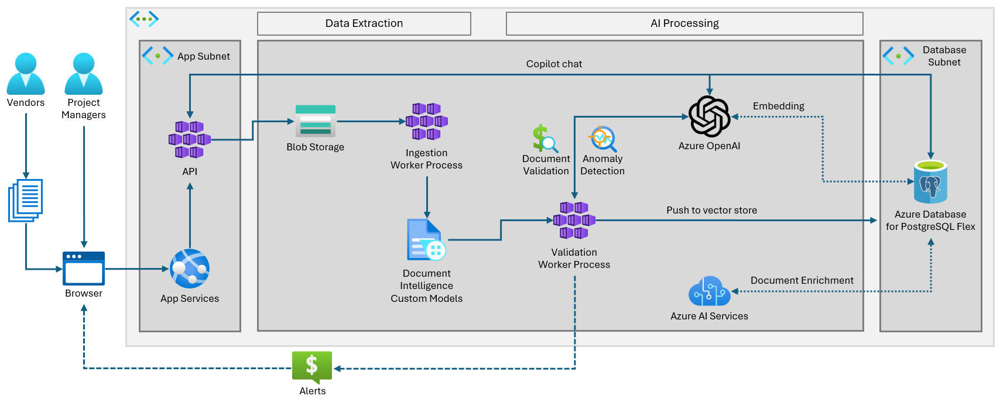
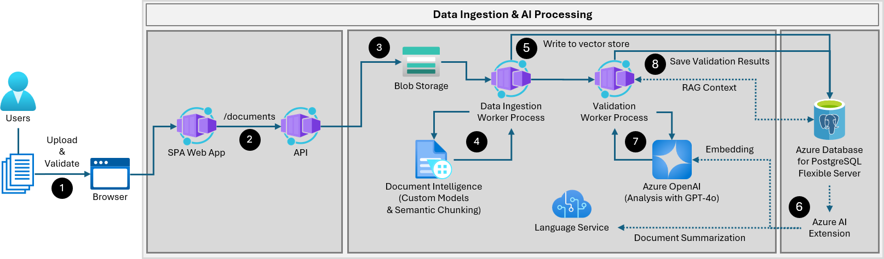

# 1.2 Application Architecture

The _Woodgrove Bank Contract Management_ application automates extracting, validating, and storing data from invoices and SOWs to minimize manual effort and boost operational efficiency while allowing internal application users to gain actionable insights from the data. By focusing on this streamlined flow, the solution effectively automates tedious tasks, reduces errors, and provides valuable insights to internal users, enhancing overall operational efficiency and decision-making.

Throughout this solution accelerator, you will enhance the application with AI capabilities. The application consists of a REACT single page application (SPA) providing the UX (user experience), a backend API written in Python using FastAPI, and various Azure services. The solution implements the following high-level architecture:

!!! tip "Decoupled application architecture"

    Separating app functionality into a dedicated UI and backend API offers several benefits. Firstly, it enhances modularity and maintainability, allowing you to update the UI or backend independently without disrupting the other. REACT and Node.js provide an intuitive and interactive user interface that simplifies user interactions, while the Python API leveraging FastAPI ensures high-performance, asynchronous request handling and data processing. This separation also promotes scalability, as different components can be deployed across multiple servers, optimizing resource usage. Additionally, it enables better security practices, as the backend API can handle sensitive data and authentication separately, reducing the risk of exposing vulnerabilities in the UI layer. This approach leads to a more robust, efficient, and user-friendly application.

---

## Application Data Flow

Select each tab below to learn more about how the movement of data in the context of the Woodgrove Bank Contract Management application!_

=== "Data Ingestion & AI Processing"

    !!! info "How The Automated Data Ingestion and AI Validation Process Works"

        Internal users and external vendors can introduce new documents, SOWs, and invoices into the system via an intuitive browser-based user interface. This action kicks off automated processes to extract and validate the data within those documents. Extracted data and validation results are returned to the users in the UI, allowing them to review and make updates as necessary.

    

    1. SOWs, invoices, and related documents are ingested via the Woodgrove Bank Contract Management Portal, a REACT Single Page Application (SPA) accessed through a web browser. Internal users and external vendors can submit documents via the portal.

    2. The SPA web app sends uploaded documents directly with the backend API's `/documents` endpoint.

    3. The API, hosted as an [Azure Container App](https://learn.microsoft.com/azure/container-apps/overview) (ACA), saves the uploaded documents into a container in Azure Blob storage.

          1. Storing the original documents in blob storage allows raw data to be persisted.

          2. Should processing errors be detected or system requirements change, documents can be easily reprocessed.

    4. When new documents are added into blob storage, an Event Grid trigger is fired, starting the Data Ingestion Worker Process.

          1. The data ingestion worker process handles data extraction and processing by sending uploaded documents to the Azure AI Document Intelligence service.

          2. Custom AI models within the Document Intelligence service are tailored to extract specific data fields, such as payment milestones, due dates, billable amounts, and vendor details. These models are trained to recognize the structure of financial documents, improving data extraction accuracy.

          3. Document Intelligence's Semantic Chunking capability recognizes document structures, capturing headings and chunking the content body based on semantic coherence, such as paragraphs and sentences. This ensures that the chunks are of higher quality for use in RAG pattern queries.

    5. The extracted document data is securely stored in Azure Database for PostgreSQL flexible server.

    6. As part of the database insert statement, the GenAI capabilities of the `azure_ai` extension are used to:

          1. Generate and save vector embeddings of document text using Azure OpenAI.

          2. Create abstractive summaries of SOWs using the Azure AI Language service.

    7. Document data is sent through an AI-driven data validation process that uses Azure OpenAI to analyze the incoming data, ensuring it conforms to expected standards and is accurate based on related data already in the system.
        
           1. Azure OpenAI's GPT-4o language model reviews all document data, employing natural language understanding to validate and cross-check information and ensure high data integrity.
           
           2. The RAG pattern allows the language model to cross-reference data between invoices and SOWs, evaluating payment milestone completion and billing and preventing issues like payment delays. It also validates that appropriate document sections and required compliance language exist in contracts and SOWs, helping to avoid incomplete contracts and compliance violations.

    8. The data validation results are securely stored in Azure Database for PostgreSQL alongside the analyzed data.

=== "AI Copilot with RAG"

    !!! info "How The Custom Copilot Experience Works"

        Internal users interact with data through an intelligent copilot that employs the Retrieval Augmented Generation (RAG) pattern. This copilot allows users to ask questions about contract data, offering valuable insights into vendor contract fulfillment and invoicing accuracy.

    

    1. Users interact with the _Woodgrove Bank Contract Management Copilot_ through a browser interface to pose queries or seek information.

    2. The REACT SPA sends these chat messages to the `/chat` API endpoint hosted in ACA.

    3. The request query is embedded using the `text-embedding-ada-002` model in Azure OpenAI.

    4. A **hybrid search** is performed on the Azure Database for PostgreSQL flexible server, where the system searches for relevant data.

          1. Hybrid search combines full-text search with vector-based search to provide more accurate and relevant results. It allows you to perform searches using both traditional keyword matching and semantic similarity, leveraging embeddings to understand the context and meaning behind the text.

          2. By integrating these two methods, hybrid search enhances the precision and comprehensiveness of search results, making it ideal for applications like semantic search, recommendation systems, and content discovery.

    5. (Optional) Semantic Ranking via custom model inference from the `azure_ai` extension ranks search result relevance and is returned into the RAG context as part of the composite prompt.

    6. Azure OpenAI uses the composite prompt to formulates a response.

          1. The composite prompt contains the system prompt augmented with context provided by the results of the hybrid search against the PostgreSQL database.

    7. The AI-generated completion response is sent back to the user through the browser interface, providing them with actionable insights based on the data stored in the system. The efficient flow of information ensures users can quickly and accurately obtain the information they need.
