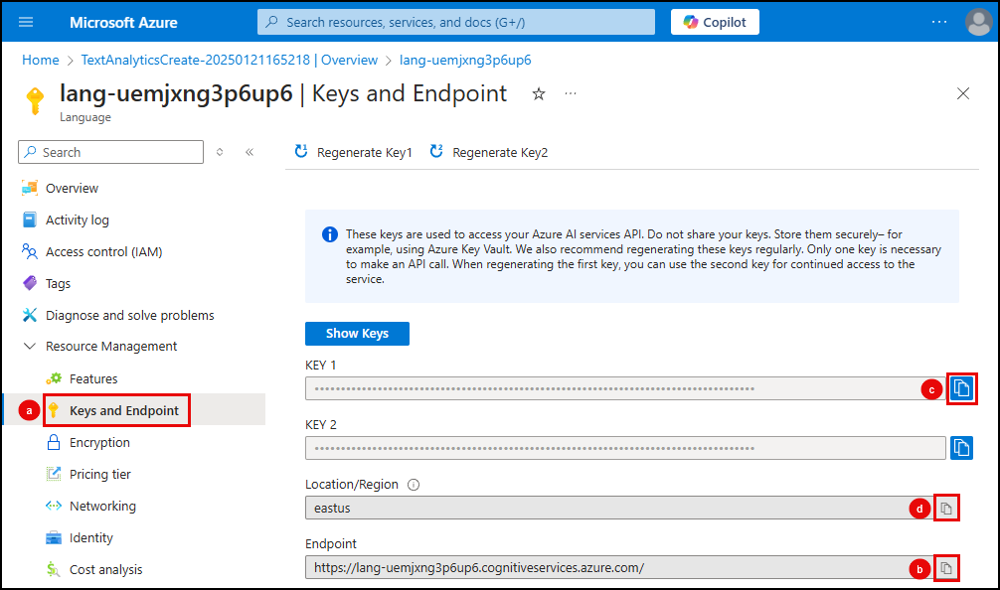
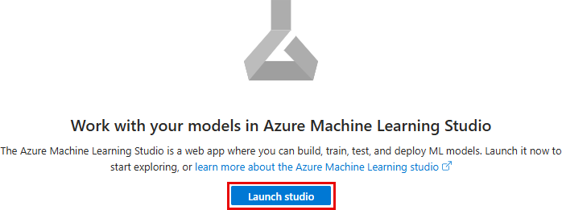

# 3.2 Configure the Azure AI extension

The `azure_ai` extension lets you directly integrate the Azure OpenAI, Azure AI Language, and Azure ML services into your database. To start using the extension's capabilities, you must first configure its connection to your Azure AI and ML services, providing each service's endpoint and subscription key.

## Execute SQL in pgAdmin to configure the extension

You will use **pgAdmin** to configure the `azure_ai` extension by executing SQL commands against your database.

1. On your local machine, return to the open instance of **pgAdmin** (or open it if you closed it after the setup tasks) and ensure it is connected to your PostgreSQL database.

2. In the pgAdmin **Object Explorer**, expand databases under your PostgreSQL server.

3. Right-click the **contracts** database and select **Query Tool** from the context menu.

!!! danger "Select each tab below and execute SQL statements provided to connect to each Azure AI service."

=== "Azure OpenAI"

    The Azure AI extension includes the `azure_openai` schema, which allows you to integrate the creation of vector representations of text values directly into your database by invoking [Azure OpenAI embeddings](https://learn.microsoft.com/azure/ai-services/openai/reference#embeddings). The vector embeddings can then be used in vector similarity searches.

    1. In the new pgAdmin query window, paste the following SQL commands to configure the extension's connection to Azure OpenAI using the `set_setting()` function. Do not run the commands yet, as you first need to retrieve the endpoint and API key for your Azure OpenAI resource.

        ```sql
        SELECT azure_ai.set_setting('azure_openai.endpoint', '<endpoint>');
        SELECT azure_ai.set_setting('azure_openai.subscription_key', '<api-key>');
        ```

    2. In a browser window, navigate to your Azure OpenAI service in the [Azure portal](https://portal.azure.com/).

    3. On the Azure OpenAI service page:

          1. Select the **Keys and Endpoint** menu item under **Resource Management**.

          2. Copy the **Endpoint** value, paste it as the `<endpoint>` value in the query to set the `azure_openai.endpoint` value in your pgAdmin query window.

          3. Copy the **KEY 1** value, paste it as the `<api-key>` value in the query to set the `azure_openai.subscription_key` value in your pgAdmin query window.

           

    4. In pgAdmin, execute the updated SQL commands by selecting the **Execute script** button.

        

    5. The `azure_ai` extension also provides the `get_setting()` function, allowing users with appropriate permissions to view the values stored in each schema's `endpoint` and `key` settings. Run the following queries to view the Azure OpenAI endpoint and key values stored in the database.

        ```sql title=""
        select azure_ai.get_setting('azure_openai.endpoint');
        ```
    
        ```sql title=""
        select azure_ai.get_setting('azure_openai.subscription_key');
        ```

=== "Language service"

    The Azure AI services integrations included in the `azure_cognitive` schema of the `azure_ai` extension provide a rich set of AI Language features accessible directly from the database.
    
    1. In the pgAdmin query window, overwrite the previous commands by pasting the following SQL commands to configure the extension's connection to your Language service. Do not run the commands yet, as you first need to retrieve your service's endpoint and API key.

        ```sql
        SELECT azure_ai.set_setting('azure_cognitive.endpoint', '<endpoint>');
        SELECT azure_ai.set_setting('azure_cognitive.subscription_key', '<api-key>');
        ```

    2. In a browser window, navigate to your Language service in the [Azure portal](https://portal.azure.com/).

    3. On the Language service page:

          1. Select the **Keys and Endpoint** menu item under **Resource Management**.

          2. Copy the **Endpoint** value, paste it as the `<endpoint>` value in the query to set the `azure_cognitive.endpoint` value in your pgAdmin query window.

          3. Copy the **KEY 1** value, paste it as the `<api-key>` value in the query to set the `azure_cognitive.subscription_key` value in your pgAdmin query window.
       
           
        
    4. In pgAdmin, execute the updated SQL commands by selecting the **Execute script** button.        

=== "Azure ML (Optional)"

    The Azure AI extension allows you to invoke any machine learning models deployed on Azure Machine Learning (ML) online endpoints from within SQL. These models can be from the Azure ML catalog or custom models that have been trained and deployed.

    !!! warning "Only configure the Azure ML endpoint if you selected TRUE to `deployAMLModel` during the `azd up` deployment."

    1. In the pgAdmin query window, overwrite the previous commands by pasting the following SQL commands to configure the extension's connection to Azure ML. Do not run the commands yet, as you first need to retrieve the endpoint and key for the model deployed on Azure ML.

        ```sql
        SELECT azure_ai.set_setting('azure_ml.scoring_endpoint','<endpoint>');
        SELECT azure_ai.set_setting('azure_ml.endpoint_key', '<api-key>');
        ```

    2. In a browser window, navigate to your Azure ML workspace in the [Azure portal](https://portal.azure.com/).

    3. From the Azure ML workspace page, select the **Launch studio** button to open Azure Machine Learning Studio in a new browser window.

        

    4. Sign into Machine Learning Studio if prompted.

    5. In Machine Learning Studio, select **Endpoints** under **Assets** in the left-hand resource menu, then select the endpoint for your `bge-v2-m3-reranker model`:

        

    6. On your endpoint page:

       1. Select the **Consume** tab.
       2. Copy the **REST endpoint** value, paste it as the `<endpoint>` value in the query to set the `azure_ml.scoring_endpoint` value in your pgAdmin query window.
       3. Copy the **Primary key** value, paste it as the `<api-key>` value in the query to set the `azure_ml.endpoint_key` value in your pgAdmin query window.
       
           
        
    7.  In pgAdmin, execute the updated SQL commands by selecting the **Execute script** button.

!!! danger "Be sure to run the scripts to add the endpoints and keys for all three services (Azure OpenAI, Language Service, and Azure Machine Learning) in the database."
