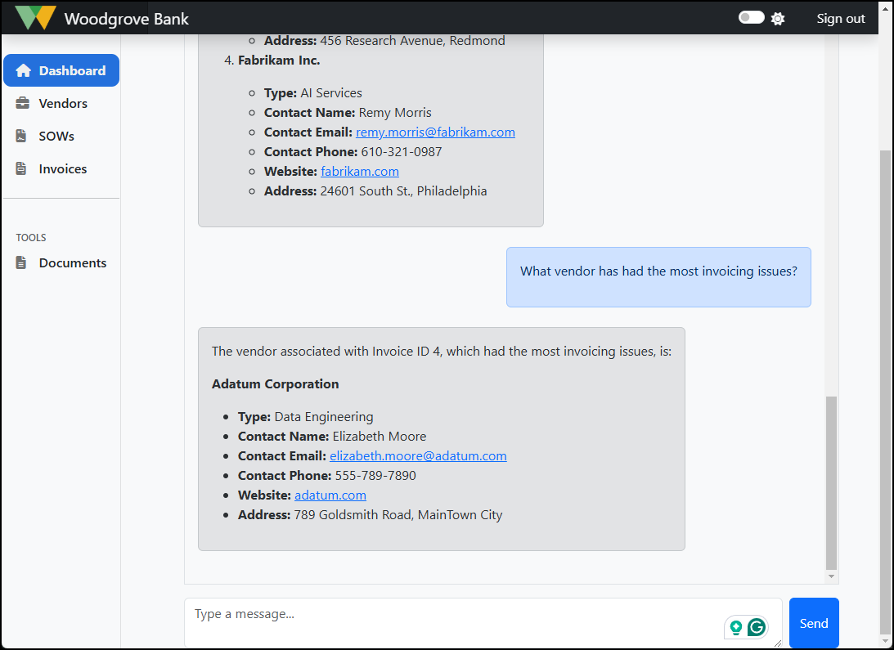

# 5.7 Test the UI Copilot Chat

You are now ready to test the end-to-end copilot chat feature. You will need to run the FastAPI server and the React SPA locally from VS Code debug sessions. In this next section, you will see how to do this locally for rapid prototyping and testing.

## Test with VS Code

Visual Studio Code provides the ability to run applications locally, allowing for debugging and rapid testing.

### Start the API

The UI relies on the _Woodgrove Bank API_ to be running. As you did to test the API via its Swagger UI, follow the steps below to start a debug session for the API in VS Code.

1. In Visual Studio Code **Run and Debug** panel, select the **API Debugger** option for your OS from the debug configurations dropdown list.

    

2. Select the **Start Debugging** button (or press F5 on your keyboard).

    

3. Wait for the API application to start completely, indicated by an `Application startup complete.` message in the terminal output.

    

### Start the Portal

With the API running, you can now start a second debug session in VS Code for the Portal project.

1. Return to the **Run and Debug** panel in Visual Studio Code and select the **Portal Debugger** option from the debug configurations dropdown list.

    

2. Select the **Start Debugging** button (or press F5 on your keyboard).

    

3. This should launch the _Woodgrove Bank Contract Management Portal_ in a new browser window (<http://localhost:3000/>).

4. On the **Dashboard** page, enter the following message into the chat and send it:

    ```bash title=""
    What IT vendors are we working with?
    ```

    

5. Next, ask the following question about vendor invoicing accuracy:

    ```bash title=""
    What vendor has had the most invoicing issues?
    ```

    

The response to the previous question may be accurate, but the copilot did not provide you with any insights about why this vendor was specified as the one with the most invoicing issues. It is also possible that you received an error because the copilot does not have enough guidance to correctly select the right function for augmenting the prompt. In either case, prompt engineering can help to improve your copilot's respones!

In the next task, you will iterage on your copilot's prompt to refine it and improve the quality and groundedness of the responses it provides.

!!! tip "Leave the API and Portal debug sessions running for the next task."
